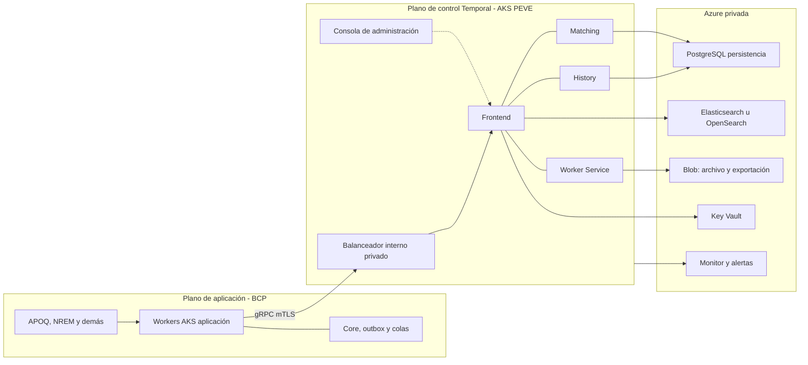
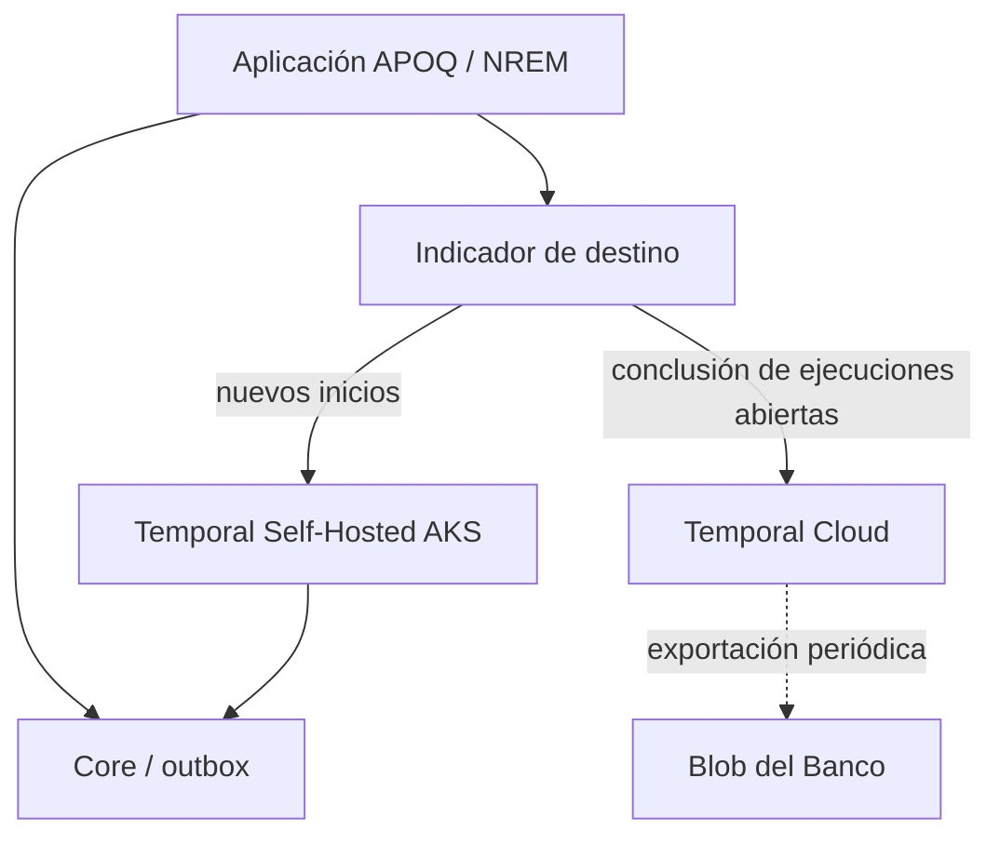
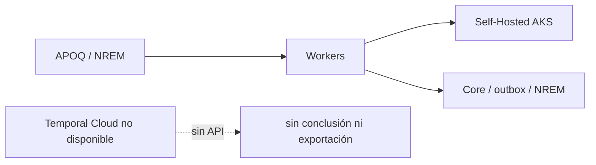
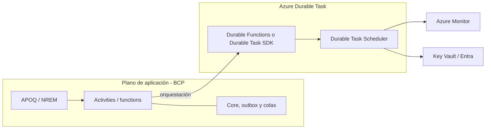
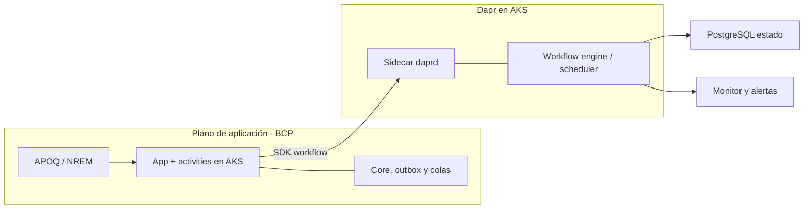

# Plan de retiro preventivo de Temporal Cloud ante insolvencia del proveedor

**BCP / PEVE / Versión 1.2**  
Datos elaborados por BCP para uso interno.  
Documento de decisión asociado: resumen para la instancia aprobadora.

| Control | Valor |
|---|---|
| Código | PEVE-PR-2026-001 |
| Versión | 1.2 |
| Estado | Final para aprobación. La fase 0 queda pendiente de ejecución. La sección 04.6 documenta destinos alternativos; el vigente sigue siendo Self-Hosted. |
| Clasificación | Uso interno BCP |
| Dueño | PEVE |
| Revisores | Arquitectura, Seguridad, Continuidad, RNF, Legal / Compras, PO APOQ, PO NREM |
| Aprobador | Instancia aprobadora |
| Vigencia | Hasta la siguiente revisión anual o un cambio material |
| Relacionado | Planes de continuidad y recuperación de Temporal Cloud; receta de despliegue de cada aplicación |

Los campos en cursiva de los anexos A, C, F y G se completan durante la fase 0, con la información de cada dueño.

---

## Ficha del documento

| Campo | Contenido |
|---|---|
| Servicio | Temporal Cloud (orquestación y persistencia del estado de workflows) |
| Proveedor | Temporal Technologies Inc. |
| Función | Crítica / servicio significativo de procesamiento de datos |
| Destino | Temporal Self-Hosted en Azure AKS del Banco (vigente). Alternativas con soporte de proveedor: sección 04.6 |
| Riesgo cubierto | Insolvencia, liquidación, cese de operaciones o pérdida material de capacidad del proveedor para operar Temporal Cloud |
| Fuera de alcance | Terminación comercial o renegociación de precio. Un destino distinto a Self-Hosted (Azure Durable Functions o Dapr Workflows) requiere aprobación formal de Arquitectura, Compras y la instancia |
| Gobierno | PEVE gobierna el plan y entrega la receta técnica. Los equipos de aplicación ejecutan y validan su migración. |
| Naturaleza | Preventivo y activable. La alternativa se prepara con anticipación y se ejecuta cuando se declara la pérdida de continuidad del proveedor o el cese del servicio. |

Temporal Cloud es operado por Temporal Technologies Inc. El servidor Temporal, con licencia MIT, puede instalarse y operarse en la infraestructura del Banco. La orquestación se mantiene en el mismo motor, con historiales y estado de negocio bajo control del BCP.

Los workers ya se ejecutan en AKS del Banco. El cambio corresponde al plano de control y a la conexión, no al cómputo de las aplicaciones.

---

## Principios

1. **Continuidad y ausencia de duplicidad.** No se admite la doble ejecución de efectos de negocio (débito, crédito, remesa o liquidación). Las activities deben ser idempotentes. Un schedule o un workflow no puede estar activo a la vez en Cloud y en Self-Hosted.
2. **Destino aprobado.** La migración se realiza hacia Temporal Self-Hosted en Azure AKS. Las alternativas de la sección 04.6 (Azure Durable Functions y Dapr Workflows) existen para cuando el criterio dominante sea el soporte contractual del proveedor; no se adoptan en la activación sin aprobación formal.
3. **Preparación previa.** La plataforma objetivo, la receta, el inventario y la exportación de historiales deben existir antes de la notificación del proveedor.
4. **Dos modos de actuación.** En reorganización o venta puede existir una ventana para concluir workflows en Cloud. En liquidación o interrupción definitiva no se espera cooperación del proveedor: se conmuta a Self-Hosted y se reconstruye desde el estado de negocio.
5. **Migración por ambientes.** El orden es desarrollo, certificación y producción. No hay pase productivo sin conformidad técnica, funcional y de seguridad.
6. **Responsabilidad distribuida.** PEVE estandariza y consolida. Cada aplicación inventaría, migra, concilia y conserva evidencias.
7. **Retiro de Cloud.** No se retiran configuraciones ni accesos de Cloud mientras exista estado por tratar, salvo que el servicio ya no responda. En ese caso rige el modo estresado.
8. **Evidencia.** Se conserva evidencia técnica, funcional, de continuidad, de datos, de seguridad, contractual y de riesgo.

---

## 01. Identificación y criticidad

Temporal Cloud soporta la orquestación y la persistencia del estado de workflows de aplicaciones del BCP. Al ser un servicio gestionado, su continuidad depende de la estabilidad operativa, financiera y contractual de Temporal Technologies Inc.

El retiro cubre las aplicaciones del BCP que usan o tienen previsto usar Temporal Cloud, en ambientes productivos y no productivos, hasta que no quede ninguna dependencia activa del Banco en el servicio.

**Incluye:** aplicaciones, workflows (activos, históricos, fallidos, compensados o en reproceso), namespaces, workers en AKS, endpoints, red, certificados, secretos, pipelines, observabilidad, pruebas, aprobaciones y evidencias de cierre.

**No incluye:** aplicaciones de empresas distintas a BCP; cambios funcionales que no sean necesarios para el retiro; la adopción de un destino de la sección 04.6 sin aprobación formal; la ejecución detallada de los cambios de cada aplicación, que se documenta en sus procedimientos de despliegue aplicando la receta de PEVE.

### Inventario

| Aplicación | Proceso | Ambiente | Prioridad | Tratamiento |
|---|---|---|---|---|
| APOQ | Transferencias entre cuentas: débito, crédito, compensación y recuperación ante fallos | Producción | Alta | Migración controlada a Self-Hosted |
| NREM | Gestión de remesas, emisión y recepción | Producción | Alta | Migración controlada a Self-Hosted |
| CPCA | Capa Producto Cuenta Ahorros del Nuevo Autorizador | Desarrollo / certificación | Antes de producción | Migrar o retirar |
| CPCC | Capa Producto Cuenta Corriente del Nuevo Autorizador | Desarrollo / certificación | Antes de producción | Migrar o retirar |
| APTI / TUPI | Pagos y transferencias digitales de alto volumen | Desarrollo / certificación | Antes de producción | Migrar o retirar |
| CDPT | Capa de negocio para pagos y transferencias | Desarrollo / certificación | Antes de producción | Migrar o retirar |
| SRCR | Tracking de pagos y renovación tecnológica | Desarrollo / certificación | Antes de producción | Migrar o retirar |
| LBCL | Transferencias interbancarias BCR y liquidación en LBTR | Desarrollo / certificación | Antes de producción | Migrar o retirar |
| CPCR | Nuevo Core de Cuentas | Desarrollo / certificación | Antes de producción | Migrar o retirar |

APOQ y NREM pueden avanzar como frentes paralelos. No se ha identificado dependencia técnica o funcional entre ambas. Cada aplicación cumple de forma independiente la preparación, las pruebas, la aprobación y el cierre.

Las aplicaciones no productivas deben migrarse a Self-Hosted antes de un eventual pase a producción. Si el dueño decide no continuar, se congelan o retiran con evidencia. No se habilitará producción nueva sobre Temporal Cloud.

**Patrón de namespaces.** Código de aplicación en minúsculas seguido del ambiente, por ejemplo apoq-dev, apoq-cert y apoq-prod. El inventario operativo mantiene la correspondencia real entre Cloud y Self-Hosted.

**Clasificación.** APOQ y NREM son funciones críticas en producción. El resto es material por el tipo de proceso (autorizador, pagos, LBTR, core de cuentas), aunque aún no esté en producción, y no debe pasar a producción sobre Temporal Cloud mientras el proveedor esté en vigilancia.

---

## 02. Objetivos

**General.** Definir el marco técnico, operativo, contractual, de continuidad y de seguridad para retirar Temporal Cloud del BCP y migrar los casos de uso al destino vigente (Temporal Self-Hosted en Azure AKS), o a un destino de la sección 04.6 si la instancia lo aprueba, sin comprometer la continuidad de las aplicaciones productivas ni la trazabilidad de los workflows.

**Específicos**

- Mantener el inventario de aplicaciones, workflows, namespaces, workers y dependencias.
- Tener la plataforma objetivo y la receta listas antes de la activación.
- Establecer el criterio de activación y las acciones inmediatas.
- Preservar continuidad, integridad, trazabilidad y evidencia de los workflows.
- Impedir la ejecución simultánea de un mismo workflow o schedule en ambos ambientes.
- Definir controles de seguridad, accesos y cierre de credenciales.
- Establecer criterios de entrada a producción y de cierre del retiro.

---

## 03. Escenarios y supuestos

El riesgo cubierto es la pérdida de continuidad operativa del proveedor, no un incidente técnico transitorio de Temporal Cloud. Los incidentes de corta duración se tratan en los planes de continuidad y recuperación. Este plan modela tres desenlaces de insolvencia. El resultado financiero negativo del proveedor es un elemento de vigilancia, no el disparador del retiro.

| Desenlace | Situación de Temporal Cloud | Actuación del Banco | Cooperación del proveedor | Horizonte |
|---|---|---|---|---|
| Reorganización concursal | El servicio suele continuar. El contrato puede asumirse o rechazarse | Activar el plan, congelar usos nuevos en Cloud y migrar por ambientes | Limitada. No se depende de servicios profesionales del proveedor | Semanas |
| Venta o cambio de control | El servicio continúa y cambia el dueño | Misma ruta técnica. Se evalúa si el comprador es aceptable para el Banco | Media o alta | Semanas a meses |
| Liquidación o cese abrupto | El plano de control puede interrumpirse. No hay exportación ni soporte | Conmutar a Self-Hosted y reabrir los casos críticos desde el estado de negocio | Nula | Horas a pocos días |

### Supuestos

- El servidor Temporal y los SDK permanecen disponibles como código abierto. El Banco puede operar el mismo motor.
- No existe una migración oficial de Temporal Cloud hacia Self-Hosted. La salida se realiza en la aplicación, mediante cambio de endpoint o conexión dual, no mediante copia de la base de datos del proveedor.
- La exportación de historiales de Cloud requiere que el servicio esté disponible y se ejecuta de forma periódica. Si no se ha copiado a almacenamiento del Banco antes de la activación, el historial vivo no será recuperable.
- Temporal orquesta la ejecución. El registro de negocio reside en el core, outbox, colas y conciliaciones de APOQ y NREM. En modo estresado, la pérdida máxima de información aceptable se mide contra ese estado, no contra el historial de Cloud.
- Los workers ya se ejecutan en AKS del Banco. El payload enviado a Temporal se encuentra cifrado.
- En liquidación no hay un periodo de transición contractual efectivo.

### Exclusiones de escenario

Una caída transitoria de región, una degradación de corta duración o un incidente de seguridad del servicio se atienden con los planes de continuidad y recuperación. Si el incidente se convierte en cese material, se declara el escenario de este plan.

---

## 04. Solución alternativa y arquitectura objetivo

El destino aprobado es Temporal Self-Hosted en Azure AKS, operado por el Banco. PEVE opera el plano de control. Las aplicaciones siguen operando sus workers. No se adoptará otra plataforma en el momento de la activación, salvo acta previa del paso 0.0 sobre una opción de la sección 04.6.

Arquitectura emite conformidad del patrón. Seguridad valida autenticación, autorización, certificados, cifrado, red, registro de eventos y segregación.

### 04.1 Diagrama de la propuesta

La arquitectura se organiza en tres planos. El Frontend no se expone a internet público.

1. **Aplicación.** APOQ, NREM y las demás aplicaciones del inventario. Los workers permanecen en el AKS del Banco. El core, el outbox y las colas constituyen el registro de negocio.
2. **Plano de control Temporal (AKS PEVE).** Frontend, History, Matching y Worker Service, detrás de un balanceador interno. La consola web se usa solo para administración.
3. **Plataforma Azure privada.** Persistencia, visibilidad, archivo de historiales, secretos y monitoreo, con Private Link o red virtual privada.

### 04.2 Decisiones de diseño

| Decisión | Propuesta | Motivo |
|---|---|---|
| Ubicación del servidor Temporal | AKS dedicado de PEVE, fuera del namespace de la aplicación | Separar la operación de plataforma y la de negocio |
| Instalaciones | Dos: no productiva (desarrollo y certificación) y productiva | Aislar producción y ensayar la receta sin afectar críticos |
| Persistencia | Azure Database for PostgreSQL Flexible Server, con alta disponibilidad y respaldo | Almacén soportado por Temporal y operado en Azure |
| Visibilidad | Elasticsearch u OpenSearch en Azure | Búsqueda de workflows para operación y auditoría |
| Archivo de historiales | Azure Blob (workflows cerrados) | Conservación más allá de la retención del clúster |
| Exportación desde Cloud | Proceso periódico hacia Blob del Banco, mientras Cloud esté disponible | En la activación solo existirá lo ya copiado |
| Acceso al Frontend | Balanceador interno y Private Link, sin dirección pública | Reducir superficie de exposición y controlar residencia |
| Autenticación | mTLS o equivalente aprobado, con identidades en Key Vault | No reutilizar las credenciales de Cloud |
| Workers de aplicación | Permanecen en el AKS actual | El cambio es de conexión |
| Payload | Cifrado en tránsito y en el contenido de negocio | Control ya aplicado por el Banco |
| Namespaces | Código de aplicación y ambiente en cada instalación | Segregación apoq-prod, nrem-prod y equivalentes |
| Recuperación del plano de control | Respaldo y restauración ensayados; segunda zona de disponibilidad en producción | Corresponde a la continuidad de Self-Hosted, no al retiro de Cloud |
| Alcance técnico excluido | Réplica oficial Cloud hacia Self-Hosted y copia de la base de datos de Cloud | El producto no lo ofrece |

La versión del servidor Temporal, el número de particiones de historial y el dimensionamiento de nodos los define PEVE en el Anexo B.

### 04.3 Tratamiento por componente

| Componente | Tratamiento |
|---|---|
| Plano de control | Clúster Self-Hosted en AKS, con alta disponibilidad, respaldo, restauración, observabilidad y control de accesos |
| Workers | Permanecen en AKS del Banco. Se actualizan endpoint, credenciales, certificados y parámetros |
| Namespaces | Equivalentes por aplicación y ambiente |
| Identidad y secretos | Accesos nuevos en Self-Hosted. Revocación de Cloud al cierre |
| Red | Resolución, rutas, puertos, balanceador interno y Private Link |
| Pipelines | Variables por ambiente y trazabilidad del cambio |
| Observabilidad | Registros, métricas, trazas, alertas y tableros sobre Self-Hosted |
| Historiales cerrados | Archivo en Blob y exportación desde Cloud hacia Blob |
| Operación | Procedimiento de incidente, restauración, actualización y escalamiento a cargo de PEVE |

### 04.4 Arquitectura de transición (conexión dual)

Mientras Temporal Cloud responda, el worker utiliza un solo clúster activo por workflow. El indicador de configuración decide el destino de los nuevos inicios. La reversa solo aplica en este modo.

Un identificador de workflow o un schedule no debe estar activo en Cloud y en Self-Hosted al mismo tiempo. Si Self-Hosted no cumple los criterios de aceptación, los nuevos inicios pueden volver a Cloud únicamente mientras ese servicio siga operable.

### 04.5 Arquitectura de conmutación en modo estresado

Si Temporal Cloud no responde, no hay conexión dual ni exportación. Los workers apuntan solo a Self-Hosted. Las ejecuciones abiertas en Cloud se consideran no recuperables como historial y se reconstruyen desde el core.

### 04.6 Opciones alternativas de destino

El destino vigente de la fase 0 es Temporal Self-Hosted: conserva el motor, los SDK y la receta de conexión dual. El Banco opera el plano de control y **no recibe soporte de Temporal Technologies Inc.** sobre el binario de código abierto. Ese es el intercambio: se elimina la dependencia de continuidad del proveedor y se asume la operación.

Si el criterio dominante es que las aplicaciones críticas (APOQ, NREM) tengan **soporte contractual del proveedor** —mesa, SLA, parches y escalamiento—, Self-Hosted no lo cubre. En ese caso existen dos destinos principales. Ninguno es un cambio de endpoint: exigen reescritura de workflows y no admiten conexión dual con Temporal Cloud.

#### Criterio de selección

| Criterio | Peso para el Banco | Qué se exige |
|---|---|---|
| Soporte del proveedor | Determinante para críticos | Contrato, SLA, canal 24×7 o equivalente al plan de soporte Azure / enterprise, y contraparte que el Banco pueda contratar |
| Continuidad del proveedor | Alto | El destino no debe repetir la concentración en un proveedor joven cuyo cese deje el plano de control inoperable |
| Contratos y nube ya existentes | Alto | Preferir Azure y proveedores ya aceptados por Compras y Seguridad |
| Reescritura y tiempo de salida | Alto | APOQ y NREM ya están en producción sobre Temporal. Un cambio de motor alarga la fase 0 |
| Residencia y operación en Azure | Alto | AKS, red privada, Key Vault, residencia aceptada |
| Modelo de programación | Medio | Workflows de débito, crédito, remesa, compensación, schedules e idempotencia |

No se evalúan como destino de críticos: Camunda 8 (BPMN / Zeebe; otra categoría, no ejecución durable en código); AWS Step Functions (el Banco está en Azure); Logic Apps (iPaaS); Cadence u Orkes Conductor (grafo de tareas, no replay Temporal; Orkes además concentra soporte en un proveedor de menor escala); un segundo Temporal Cloud en otra cuenta (sigue siendo Temporal Technologies Inc.).

#### Opción principal 1 — Azure Durable Functions y Durable Task Scheduler

Microsoft opera el plano de control. El Banco ya tiene contratos Azure. El soporte es el plan de soporte Microsoft (Unified o el que Compras tenga vigente), no un proveedor de orquestación distinto.

| Elemento | Propuesta |
|---|---|
| Producto | Azure Durable Functions, con **Durable Task Scheduler** como backend gestionado (recomendado por Microsoft para producción). Alternativa de menor lock-in: Durable Task SDK con persistencia MSSQL en Azure, operada por el Banco |
| Proveedor de soporte | Microsoft. Mismo canal que el resto de Azure del BCP |
| Fortaleza | Contratos existentes, residencia en Azure, identidad (Entra / managed identity), Private Link, tablero nativo del Scheduler, SLA de Azure sobre el servicio gestionado |
| Debilidad | Reescritura completa de workflows Temporal (signals, queries, search attributes, schedules, namespaces). El modelo de hosting habitual es Azure Functions, no los workers actuales en AKS; el Durable Task SDK permite otro host, pero no es el camino más documentado |
| Migración desde Cloud | No hay importación de historial. Igual que Self-Hosted: nuevos inicios en el destino; conclusión o reapertura desde el core |
| Conexión dual | No aplica. No hay dos clústeres Temporal. El indicador de destino pasa a ser “Temporal Cloud / Durable Functions” y exige dos implementaciones del mismo proceso |
| Riesgo de proveedor | Microsoft. Aceptable para el Banco. El residual es lock-in Azure, ya asumido |
| Cuándo elegirla | El Banco no quiere operar un motor de orquestación y exige soporte sobre un contrato ya firmado |

#### Opción principal 2 — Dapr Workflows en AKS

Misma categoría que Temporal: el workflow se escribe en código, se persiste el historial y se reconstruye por replay. Activities, temporizadores y eventos externos equivalen a activities, timers y signals. El runtime de Dapr Workflow se apoya en el Durable Task Framework de Microsoft. Los workers y las aplicaciones permanecen en AKS.

| Elemento | Propuesta |
|---|---|
| Producto | Dapr Workflows (sidecar en AKS), con almacén de estado que soporte workflows. En Azure: PostgreSQL. No usar Cosmos DB para este caso (límite de 2 MB y 100 operaciones por transacción; no hay migración posterior) |
| Proveedor de soporte | Microsoft, sobre AKS y la extensión Dapr de Azure, más el plan de soporte ya contratado. Dapr es CNCF; el canal útil para el Banco es Azure, no el foro de la comunidad |
| Fortaleza | Modelo comparable a Temporal (código, replay, activities). Los procesos siguen en AKS, no hay que pasarlos a Azure Functions. Identidad, red privada y residencia ya aceptadas. Misma familia que la opción 1, otro hosting |
| Debilidad | Reescritura de SDK Temporal. Versionado, search attributes y visibilidad son más débiles que en Temporal. El building block de workflows es más joven que el servidor Temporal; hay que fijar versión soportada (N y N-2) y ensayar restauración del state store |
| Migración desde Cloud | No hay importación de historial. Nuevos inicios en Dapr; conclusión o reapertura desde el core |
| Conexión dual | No aplica. Dos implementaciones del proceso hasta el corte |
| Riesgo de proveedor | Microsoft / Azure. Aceptable para el Banco. El residual es la madurez de Dapr Workflows para volumen y duración de APOQ y NREM, y que PEVE opera sidecars y el state store |
| Cuándo elegirla | El Banco exige soporte Microsoft y quiere conservar el cómputo en AKS, con un modelo de programación del mismo tipo que Temporal |

Durable Functions (opción 1) y Dapr Workflows (opción 2) no son dos motores distintos: son dos formas de hospedar el Durable Task Framework. La 1 deja el plano de control en Microsoft (Durable Task Scheduler). La 2 lo deja en AKS junto a las aplicaciones. Se elige una, no las dos.

#### Opción evaluada, no principal — Restate

Restate (Restate.dev) es el destino más cercano en modelo mental: ejecución durable en código, SDKs (Java, TypeScript, Go, Python), servidor autoalojable o Restate Cloud, y un plan Enterprise con SLA negociado.

**No se propone como destino de APOQ ni NREM.** El motivo es el mismo que origina este plan: el Banco necesita una contraparte de soporte que sobreviva al criterio de proveedor significativo. Restate es una compañía más joven que Temporal Technologies Inc. Contratar Restate Cloud o su Enterprise **repite la concentración** (plano de control y soporte en un proveedor de orquestación de menor escala). Autoalojar Restate elimina el SaaS y **vuelve a dejar al Banco sin soporte de un proveedor comparable a Microsoft**, además de reescribir los workflows.

Restate puede usarse como referencia de diseño o como prueba de concepto no productiva. No entra en la fase 0 de críticos.

#### Comparación

| | Temporal Self-Hosted (vigente) | Azure Durable Functions | Dapr Workflows en AKS | Restate |
|---|---|---|---|---|
| Categoría | Ejecución durable en código | Ejecución durable en código (Durable Task) | Ejecución durable en código (Durable Task) | Ejecución durable en código |
| Soporte de proveedor para críticos | No. PEVE opera el OSS | Sí. Microsoft / contrato Azure | Sí. Microsoft sobre AKS / extensión Dapr | Débil para el Banco. Compañía más joven que Temporal |
| Reescritura de APOQ / NREM | Mínima (endpoint, identidad, receta) | Completa | Completa (SDK Dapr; workers en AKS) | Completa |
| Conexión dual con Cloud | Sí | No | No | No |
| Tiempo hasta fase 0 operativa | El de la sección 14 | Mayor: nuevo modelo + Functions o DTS | Mayor: sidecar, state store y pruebas de dominio | No recomendado para fase 0 |
| Residencia / Azure | AKS y PostgreSQL del Banco | Nativo Azure | AKS y PostgreSQL (no Cosmos DB) | Cloud Restate o binario en AKS |
| Riesgo que se trata | Cese de Temporal Cloud, sin cambiar de motor | Cese de Temporal Cloud y ausencia de soporte OSS | Igual, conservando cómputo en AKS | Cese de Temporal Cloud; no reduce el riesgo de proveedor joven |
| Quién opera el plano de control | PEVE | Microsoft (Scheduler) o PEVE (MSSQL) | PEVE (sidecars + state store), con soporte Azure | PEVE o Restate |

#### Decisión que se pide sobre alternativas

La instancia no está obligada a cambiar el destino. Si no hay acta en contrario, la fase 0 sigue el Anexo B (Self-Hosted).

| Pedido | Efecto |
|---|---|
| Mantener Self-Hosted | Se ejecuta la sección 14. El residual es operar el motor sin soporte de Temporal Technologies Inc. |
| Elegir Durable Functions | Se detiene el Anexo B. Arquitectura emite un patrón Azure. APOQ y NREM reescriben. No hay conexión dual. Compras usa el contrato Microsoft |
| Elegir Dapr Workflows | Se detiene el Anexo B. Arquitectura emite el patrón Dapr en AKS. State store PostgreSQL. APOQ y NREM reescriben al SDK Dapr. No hay conexión dual |
| No elegir Restate para críticos | Queda documentado como no apto bajo el criterio de soporte de proveedor |

Un cambio de destino se aprueba **antes** del paso 0.2. Después de instalar Self-Hosted, cambiar de motor no anula el trabajo de red y de inventario, pero sí anula la receta de conexión dual.

---

## 05. Análisis de impacto

El impacto de cliente se concentra en APOQ y NREM. El resto de aplicaciones no debe entrar a producción sobre Temporal Cloud.

| Aplicación | Proceso | Impacto si Cloud cesa sin plataforma alternativa | Control |
|---|---|---|---|
| APOQ | Transferencias entre cuentas | Workflows de débito, crédito o compensación a medias; riesgo de duplicar o perder un lado de la operación | Conexión dual, idempotencia, conciliación, reversa y, en modo estresado, reapertura desde el estado de negocio |
| NREM | Remesas, emisión y recepción | Remesas en curso sin orquestación; riesgo de doble emisión o pérdida de seguimiento | Los mismos controles, con conciliación de remesas |
| No productivas | Autorizador, pagos, LBTR, core | Sin impacto de cliente. Riesgo de nacer atadas a Cloud | Migrar o congelar antes de producción |

Cada aplicación debe mantener actualizados, con el PO, Continuidad y el equipo técnico, el tiempo máximo de recuperación aceptable, la pérdida máxima de información aceptable, la ventana operativa, el volumen típico de workflows, la duración (cortos o largos), los schedules, los efectos de negocio no reversibles y el dueño.

En el seguimiento se estimarán la capacidad AKS de Self-Hosted (no productiva y productiva), el esfuerzo de conexión dual por aplicación, la retención de historiales, la prueba anual de conmutación y el personal de PEVE, aplicación y seguridad. El calendario de una salida con cooperación del proveedor debe ser compatible con el plazo de preaviso contractual. El de liquidación no lo será; por ello la plataforma alternativa se prepara antes.

APOQ y NREM no se bloquean entre sí. El avance a la fase siguiente es por aplicación, con evidencias propias.

---

## 06. Disparadores

La notificación formal del proveedor es un disparador, no el único. En un escenario de insolvencia, esperar únicamente el aviso puede reducir la ventana de actuación.

| Señal | Umbral | Acción | Quién declara |
|---|---|---|---|
| Notificación formal de Temporal Technologies Inc. | Insolvencia, liquidación, disolución, cese, terminación o imposibilidad material de seguir prestando Temporal Cloud | Activación inmediata del plan | Instancia aprobadora, con evidencia custodiada por Legal |
| Comunicación contractual que anticipe la pérdida definitiva de capacidad | Preaviso de cese, rechazo del contrato en concurso o impago de la infraestructura del proveedor | Activación inmediata | Legal / Compras e instancia aprobadora |
| Duda sobre la continuidad del proveedor | Duda sustancial de auditor, incumplimiento de obligaciones financieras o imposibilidad acreditada de operar Cloud | Activación. Congelar nuevos usos de Cloud | RNF, Legal e instancia aprobadora |
| Liquidez | Horizonte de caja reducido sin financiamiento comprometido, o ronda abortada con recorte operativo material | Vigilancia formal. Conexión dual en un namespace. Acelerar la plataforma alternativa | RNF y PEVE |
| Degradación persistente de Cloud | Incidentes de prioridad alta reiterados o incumplimiento mensual del nivel de servicio atribuible al proveedor | Tratar como cese material. Migrar las aplicaciones críticas | PEVE, Continuidad e instancia aprobadora |
| Cambio de control | Fusión, venta o cambio de jurisdicción del proveedor o de sus datos | Vigilancia. Misma ruta técnica si el comprador no es aceptable | Legal, Arquitectura e instancia aprobadora |

La **vigilancia** no es la activación: consiste en congelar nuevos usos productivos de Cloud, completar el inventario, ejercitar la receta en no productivo y tener el clúster listo. La **activación** abre el calendario de migración y el seguimiento ejecutivo.

### Acciones inmediatas al activar

1. Registrar y custodiar la comunicación o el expediente de continuidad del proveedor.
2. Convocar a PEVE, aplicaciones, Arquitectura, Continuidad, RNF, Seguridad, Legal y Compras/Contratos.
3. Confirmar si Temporal Cloud sigue disponible y cuál es la ventana residual. Puede ser nula.
4. Congelar despliegues productivos nuevos sobre Temporal Cloud, salvo excepción aprobada.
5. Actualizar el inventario de aplicaciones, workflows, namespaces, workers, datos de estado y accesos.
6. Priorizar APOQ y NREM, y calendarizar el resto (migrar o congelar).
7. Abrir el seguimiento ejecutivo, el control de riesgos y el paquete de evidencias.
8. No eliminar configuraciones ni accesos de Cloud mientras exista estado por tratar y el servicio responda.

---

## 07. Gobierno y roles

| Rol | Responsabilidad | Resultado |
|---|---|---|
| Instancia aprobadora | Autorizar vigilancia, activación, excepciones, producción y cierre | Decisiones formalizadas |
| PEVE | Gobernar, priorizar, entregar la receta técnica, consolidar evidencias y mantener el plan | Seguimiento único y cierre controlado |
| Coordinación técnica | Articular aplicaciones y frentes técnicos; gestionar bloqueos y avance | Ejecución coordinada |
| Equipos de aplicación | Inventariar, configurar, migrar, probar, conciliar y evidenciar | Aplicación estable en Self-Hosted |
| PO / responsable funcional | Validar impacto, continuidad, conciliación y aceptación | Conformidad funcional |
| Arquitectura | Validar arquitectura objetivo y patrones técnicos | Conformidad arquitectónica |
| Seguridad / Ciberseguridad | Validar accesos, red, certificados, cifrado, registro y cierre seguro | Conformidad de seguridad |
| Continuidad | Validar tiempos de recuperación, pérdida de información y contingencia del modo estresado | Criterios de continuidad aprobados |
| RNF | Validar tratamiento del riesgo y evidencias | Riesgo tratado y trazable |
| Legal / Compras | Gestionar notificaciones, derechos de salida y terminación | Cierre contractual sustentado |

PEVE mantendrá un seguimiento único con avance por aplicación, ambiente, fase, riesgo, bloqueo, responsable y evidencia. Los bloqueos que comprometan continuidad, seguridad o la ventana de salida se elevan a la instancia aprobadora.

El PO valida el impacto funcional y la continuidad del proceso. El equipo técnico identifica workflows, workers, dependencias y datos de estado, ejecuta la migración y conserva las evidencias. PEVE acompaña, estandariza la receta y consolida el seguimiento.

---

## 08. Contrato y periodo de transición

Legal y Compras gestionan las notificaciones, los derechos de salida y la terminación. Conservan las comunicaciones y la constancia de cierre.

El contrato aporta valor en reorganización y venta (preaviso, asistencia, exportación y periodo de transición). En liquidación puede no haber asistencia ni mantenimiento del plano de control. El control principal del plan es la plataforma alternativa, no la cláusula contractual.

Mientras Temporal Cloud exista como contraparte:

- Custodiar el aviso y la ventana residual, si la hay.
- Exigir asistencia de salida y acceso a historiales solo si el proveedor aún opera.
- No pactar un calendario de salida más largo que la capacidad real de Self-Hosted.
- Al cierre: terminación, evidencia de que no quedan dependencias y, si hay entidad subsistente, constancia de destrucción o indisponibilidad de datos del Banco en Cloud.

La destrucción certificada de datos en Cloud se solicita cuando existe contraparte. Si no la hay, se documenta la pérdida de control sobre el residual y se retiene lo ya exportado al Banco.

---

## 09. Procedimiento técnico de transición

PEVE define la receta. Cada aplicación la ejecuta. Temporal no ofrece migración automatizada de Cloud hacia Self-Hosted: se actualiza la conexión de clientes y workers.

### Fases

| Fase | Actividades principales | Responsable líder | Resultado |
|---|---|---|---|
| 0. Preparación preventiva | Confirmación del destino (Self-Hosted vigente, o 04.6 si hay acta). Arquitectura, capacidad, receta, inventario, exportación de historiales a almacenamiento del Banco, conexión dual si el destino es Temporal, observabilidad y pruebas iniciales | PEVE / Arquitectura | Plataforma preparada antes de la activación |
| 1. Activación | Registro del aviso o del expediente, convocatoria, definición del modo (ordenado o estresado) y calendario | PEVE / instancia aprobadora | Plan activado |
| 2. Migración no productiva | Cambios en desarrollo y certificación; pruebas técnicas, funcionales, de seguridad y de observabilidad | Equipos de aplicación | Ambientes no productivos validados |
| 3. Migración productiva | Cambio controlado o conmutación, conciliación, validación, estabilización y reversa si Cloud sigue disponible | Equipos de APOQ y NREM | Aplicaciones operando en Self-Hosted |
| 4. Retiro definitivo | Eliminación de endpoints, accesos, secretos, certificados, pipelines y dependencias de Cloud | Equipos de aplicación / PEVE | Sin dependencias activas |
| 5. Cierre | Consolidación de evidencias, conformidades y cierre contractual y de riesgo | PEVE / áreas de control | Cierre aprobado |

Cada aplicación avanzará a la fase siguiente únicamente cuando cuente con evidencias satisfactorias de la fase anterior. Las excepciones se registrarán con riesgo, control compensatorio, responsable y aprobación.

### Receta de conexión

1. Crear el namespace equivalente en Self-Hosted y validar la segregación por ambiente.
2. Emitir identidad, secretos y certificados del destino. No reutilizar credenciales de Cloud.
3. Actualizar workers y clientes: endpoint, namespace y autenticación.
4. Actualizar pipelines y variables por ambiente.
5. Validar red: resolución, rutas, puertos, balanceadores y conectividad privada.
6. Asegurar registros, métricas, trazas, alertas y tableros en la plataforma objetivo.
7. Habilitar la conexión dual o el indicador de destino, con mecanismo de reversa, mientras Cloud responda.
8. Al cierre, revocar las credenciales de Cloud.

### Tratamiento de workflows

| Estado | Modo ordenado (Cloud disponible) | Modo estresado (liquidación o interrupción) |
|---|---|---|
| Nuevos inicios | Solo Self-Hosted | Solo Self-Hosted |
| Activos cortos | Concluir en Cloud. Sin ejecución simultánea | Reconstruir o cerrar desde el estado de negocio |
| Activos largos | Trasladar el estado a una nueva ejecución en Self-Hosted, o concluir en Cloud si cabe en la ventana | Reabrir desde el estado de negocio. No reejecutar efectos ya confirmados |
| Schedules | Alta en ambos ambientes; pausar en Cloud y reanudar en Self-Hosted con control que impida el disparo doble | Reanudar solo en Self-Hosted |
| Cerrados | Conservar el histórico exigido (exportación a almacenamiento del Banco y retención) | Conservar únicamente lo ya exportado o la evidencia externa |
| Fallidos | Analizar causa, conciliar y decidir reproceso o cierre | Igual, con prioridad en cuentas y remesas |
| Compensados | Mantener evidencia del resultado y de la consistencia | Igual |
| En reproceso | Controlar duplicidad, idempotencia y conciliación antes de reejecutar | Igual. Cloud pudo haber ejecutado un lado no visible |
| No productivos | Migrar si continuarán, o retirar o congelar con evidencia | Congelar pases a producción sobre Cloud |

Cada equipo documenta el mecanismo aplicado: migración, exportación, reconstrucción o evidencia externa. No se eliminan namespaces ni accesos de Cloud mientras quede estado por tratar y el servicio responda.

### Secuencia por ambiente

1. **Desarrollo.** Validar receta, conectividad, workers, autenticación y configuración.
2. **Certificación.** Validar flujos funcionales, integración, rendimiento, observabilidad y reversa.
3. **Producción.** Migrar la dependencia productiva con cambio o conmutación, conciliación y autorización.
4. **Cierre.** Retirar dependencias de Cloud y consolidar evidencias.

### Uso de la reversa

La reversa se ejecutará solo si Temporal Cloud sigue disponible y cuando la validación técnica o funcional no alcance los criterios de aceptación, existan transacciones sin conciliación, se detecte degradación relevante o no se disponga de observabilidad suficiente. La decisión y su evidencia se registrarán. En liquidación no hay reversa hacia Cloud: se estabiliza Self-Hosted y se concilia contra el core.

---

## 10. Continuidad durante la salida

Los planes de continuidad cubren la indisponibilidad de corta duración. Este plan cubre la sustitución del proveedor. Durante el retiro, Continuidad valida que APOQ y NREM no superen el tiempo máximo de recuperación ni la pérdida máxima de información aceptables.

### Controles mínimos (APOQ y NREM)

- Identificar los procesos y transacciones afectados.
- Mantener actualizados el tiempo máximo de recuperación, la pérdida máxima de información y la ventana operativa.
- Definir el tratamiento de solicitudes y workflows en curso (conclusión en Cloud, traslado de estado o reapertura).
- Aplicar monitoreo, alertas, reproceso y conciliación durante la transición.
- Disponer de reversa únicamente si Cloud está disponible.
- Obtener conformidad del PO antes de cerrar la ventana.

| Aplicación | Proceso | Control de continuidad | Validación |
|---|---|---|---|
| APOQ | Transferencias entre cuentas | Plan de cambio o conmutación, tratamiento de transacciones, conciliación, monitoreo y reversa si aplica | PO y equipo técnico |
| NREM | Remesas | Plan de cambio o conmutación, tratamiento de remesas en curso, conciliación, monitoreo y reversa si aplica | PO y equipo técnico |
| No productivas | Casos en desarrollo o certificación | Migración antes de producción o retiro controlado | Dueño y equipo técnico |

La continuidad se considera restablecida cuando los flujos críticos operan en Temporal Self-Hosted, las transacciones en curso han sido conciliadas o tratadas, la observabilidad se encuentra activa y el PO emite conformidad funcional.

Si Temporal Cloud ya no está disponible, no se espera el historial vivo. Se reabren solo los casos que el core, el outbox o las colas muestran como pendientes. Se bloquea cualquier activity cuyo efecto de negocio ya esté confirmado en el registro de la aplicación.

---

## 11. Criterios de éxito y cierre

### Criterios de éxito

- Todas las aplicaciones incluidas operan en Self-Hosted o fueron retiradas o congeladas antes de producción.
- No existen workflows productivos ni datos de estado sin tratamiento.
- Los históricos requeridos se conservan para auditoría y trazabilidad, en control del Banco.
- Se retiraron o deshabilitaron endpoints, accesos, secretos, certificados y credenciales de Temporal Cloud.
- No existe ejecución simultánea en ambos ambientes.
- Las evidencias técnicas, funcionales, de continuidad, de datos, de seguridad, contractuales y de riesgo están consolidadas.
- PEVE y las áreas de control aprueban el cierre. La instancia aprobadora lo formaliza.

### Paquete mínimo de evidencias

| Dimensión | Evidencia |
|---|---|
| Técnica | Configuración aplicada, pruebas, conectividad, pipelines y validación de estabilidad |
| Funcional | Conformidad del PO y evidencia de flujos críticos |
| Continuidad | Conciliación, tratamiento de transacciones y cumplimiento de la ventana operativa |
| Datos | Tratamiento de workflows activos e históricos, integridad y ubicación de la exportación |
| Seguridad | Accesos, secretos, certificados, registro de eventos y cierre seguro |
| Contractual | Comunicaciones, terminación o constancia de inexistencia de contraparte |
| Riesgo | Tratamiento del riesgo residual y aprobación de cierre |

### Cierre seguro

El retiro no se considera cerrado hasta evidenciar la eliminación, rotación o deshabilitación de credenciales, certificados, secretos, usuarios, conexiones y configuraciones que ya no sean requeridas en Temporal Cloud. Legal y Compras/Contratos conservarán las comunicaciones y evidencias de terminación. PEVE confirmará que no queden dependencias activas y emitirá el consolidado de cierre.

---

## 12. Pruebas, revisión y riesgo residual

### Pruebas mínimas por aplicación

- Conectividad, resolución, autenticación y autorización.
- Registro y ejecución de workflows y activities.
- Recuperación ante fallos, reintentos, compensaciones y reprocesos, sin duplicar efectos de negocio.
- Integración con dependencias de la aplicación.
- Registros, métricas, trazas, alertas y tableros.
- Rendimiento y capacidad para la carga de la aplicación.
- Conciliación funcional y técnica.
- Prueba de reversa antes de la migración productiva, si Cloud es el origen.

### Criterios de entrada a producción

- Arquitectura y controles de seguridad validados.
- Pruebas satisfactorias en desarrollo y certificación.
- Tratamiento de workflows activos e históricos definido para el modo ordenado y para el modo estresado.
- Plan de cambio, validación, conciliación y reversa aprobado, o declaración de ausencia de reversa en modo estresado.
- Observabilidad y soporte habilitados.
- Autorización de la instancia correspondiente.

### Pruebas del plan

| Nivel | Qué se prueba | Frecuencia |
|---|---|---|
| Revisión documental | Inventario, supuestos, costos, tiempos, capacidades, disparadores y compatibilidad residual del contrato | Anual o ante cambio material |
| Recorrido operativo | PEVE y las aplicaciones recorren las fases 0 a 5 y confirman que pueden ejecutarlas | Anual |
| Ejercicio técnico | Un namespace no crítico: conexión dual, conclusión o reapertura, pausa y reanudación de schedules, observabilidad | Anual |
| Ejercicio de mesa en modo estresado | Temporal Cloud no responde; conmutación a Self-Hosted; conciliación de APOQ y NREM contra el estado de negocio; aviso a control | Anual, junto con las pruebas de continuidad |

La revisión de suficiencia del plan la realiza un área que no lo elaboró (RNF o Auditoría Interna, según el mandato interno).

### Información que debe mantenerse actualizada

| Información | Responsable |
|---|---|
| Inventario de aplicaciones, workflows, workers, namespaces y dependencias | Equipos de aplicación / PEVE |
| Responsables funcionales, técnicos y aprobadores | PEVE / dueños de aplicación |
| Tiempo máximo de recuperación, pérdida máxima de información y ventanas operativas | PO / Continuidad / equipo técnico |
| Arquitectura, capacidad, accesos y controles de Self-Hosted | PEVE / Arquitectura / Seguridad |
| Receta técnica, pruebas, reversa y evidencias | PEVE / equipos de aplicación |
| Calendario, esfuerzo, bloqueos y riesgos | PEVE |
| Comunicaciones contractuales y derechos de salida | Legal / Compras |

### Riesgo residual

El riesgo residual se mantiene mientras la preparación preventiva no esté completa (clúster, conexión dual, exportación de historiales, matriz de workflows) o la información operativa no se encuentre actualizada. Completar la fase 0 permite ejecutar el retiro ante un cese del proveedor. El resultado financiero del proveedor, por sí solo, no reduce ese residual.

La versión vigente, sus actualizaciones relevantes y su cierre serán presentados a las áreas de control y a la instancia aprobadora, con trazabilidad de la revisión y de la conformidad.

---

## 13. Comunicación

| Momento | Audiencia | Mensaje | Responsable |
|---|---|---|---|
| Aprobación de esta versión | Instancia, RNF, Arquitectura, Seguridad, Continuidad, PO APOQ y PO NREM | Plan vigente. Se autoriza la fase 0. No se ejecuta la migración productiva | PEVE |
| Vigilancia | Las mismas áreas y los equipos de aplicación | Congelar namespaces productivos nuevos en Cloud. Completar el Anexo F | PEVE / RNF |
| Activación en modo ordenado | Roles de la sección 07 y mesa de cambios | Cloud disponible. Conclusión de workflows abiertos y conexión dual. Calendario por aplicación | Instancia aprobadora y PEVE |
| Activación en modo estresado | Las mismas áreas y operaciones de APOQ y NREM | Cloud no disponible. Conmutación. Conciliar contra el core. Sin reversa | PEVE y Continuidad |
| Ventana productiva | PO, operaciones y soporte | Qué opera en Self-Hosted, qué permanece en conclusión en Cloud y qué está en cola de excepción | Equipo de aplicación |
| Cierre | Legal, Seguridad, RNF e instancia | Sin dependencias activas en Cloud. Expediente del Anexo D | PEVE |
| Áreas de control y supervisor, si corresponde | Según mandato interno | Servicio significativo y, de ser el caso, cambio del proveedor de procesamiento | Legal / RNF |

No se requiere comunicado al cliente final: el cambio es de orquestación interna. Si APOQ o NREM afectan el servicio visible, se aplica el protocolo de incidente de la aplicación.

---

## 14. Hoja de ruta de la fase 0

El objetivo es completar el Anexo F. El orden siguiente es referencial. Las fechas las registra PEVE en el seguimiento.

| Paso | Entregable | Líder | Depende de |
|---|---|---|---|
| 0.0 | Acta de destino: Self-Hosted (vigente) o alternativa de la sección 04.6. Sin acta, rige Self-Hosted | Instancia / Arquitectura / Compras | Aprobación del plan |
| 0.1 | Conformidad de la arquitectura de la sección 04 (o del patrón Durable Functions / Dapr Workflows si 0.0 lo eligió) | Arquitectura / Seguridad | 0.0 |
| 0.2 | Instalación no productiva: AKS PEVE, PostgreSQL, visibilidad, Key Vault y Monitor | PEVE | 0.1 |
| 0.3 | Namespaces de desarrollo y certificación; red privada desde los workers | PEVE y redes | 0.2 |
| 0.4 | Receta de conexión dual en un namespace no crítico (ejercicio F8) | PEVE y una aplicación | 0.3 |
| 0.5 | Conexión dual de APOQ y NREM en desarrollo y certificación | Equipos APOQ y NREM | 0.4 |
| 0.6 | Exportación de Cloud hacia Blob y archivo en Self-Hosted | PEVE / Seguridad | 0.2 |
| 0.7 | Instalación productiva: alta disponibilidad, respaldo, restauración ensayada y capacidad para APOQ y NREM | PEVE | 0.5 y 0.6 |
| 0.8 | Anexo C firmado con nombres reales, y tiempos de recuperación vigentes | PO y Continuidad | 0.5 |
| 0.9 | Ejercicio de mesa “Cloud no responde” con APOQ y NREM (F9) | PEVE y Continuidad | 0.7 y 0.8 |
| 0.10 | Inventario A con antigüedad no mayor a 90 días, contrato localizado e instancia informada (F10 a F12) | PEVE / Legal | 0.9 |

Al completar el paso 0.10, la plataforma objetivo queda lista para recibir las aplicaciones. La migración productiva sigue reservada a la activación descrita en la sección 06.

---

## 15. Glosario

| Término | Significado en este plan |
|---|---|
| Temporal Cloud | Servicio gestionado de Temporal Technologies Inc. |
| Self-Hosted | Servidor Temporal de código abierto operado por el Banco en Azure AKS. Destino vigente. Sin soporte de Temporal Technologies Inc. |
| Durable Functions | Orquestación de Azure (Durable Task Scheduler o Durable Task SDK). Opción principal si el criterio es soporte Microsoft |
| Dapr Workflows | Ejecución durable en código sobre sidecars en AKS (Durable Task Framework). Opción principal si el criterio es soporte Microsoft y conservar el cómputo en AKS |
| Restate | Motor de ejecución durable en código. Evaluado y no propuesto para APOQ ni NREM |
| PEVE | Frente que gobierna el plan y opera el plano de control |
| Vigilancia | Seguimiento de la continuidad del proveedor, sin iniciar la migración productiva |
| Activación | Orden de ejecutar el retiro en modo ordenado o estresado |
| Conexión dual | Mismo worker o cliente con dos endpoints. Un solo clúster activo por ejecución |
| Conclusión en Cloud | Dejar terminar en Cloud los workflows cortos ya abiertos |
| Traslado de estado | Pasar el estado de una ejecución larga a una nueva ejecución en Self-Hosted |
| Reapertura desde negocio | Reabrir desde el core, outbox o colas, no desde el historial de Cloud |
| Ejecución simultánea | El mismo workflow o schedule activo en ambos clústeres. No está permitida |
| Efecto de negocio | Resultado no reversible (cargo, abono, remesa, liquidación interbancaria) |
| Fase 0 | Preparación preventiva. Condición para declarar el plan operativo |

---

## Anexo A. Inventario operativo

PEVE consolida. Cada equipo de aplicación completa y firma su fila. Los namespaces siguen el patrón de código de aplicación y ambiente, salvo que el inventario real documente una excepción.

| Aplicación | Namespace Cloud (esperado) | Namespace Self-Hosted | Ambiente | Workers (AKS) | Efectos de negocio no reversibles | RTO | RPO | Responsable técnico | PO |
|---|---|---|---|---|---|---|---|---|---|
| APOQ | apoq-prod | apoq-prod | Producción | Clúster AKS del Banco; endpoint a actualizar | Débito, crédito, compensación | *PO / Continuidad* | *PO / Continuidad* | *equipo APOQ* | *PO APOQ* |
| APOQ | apoq-cert / apoq-dev | apoq-cert / apoq-dev | Certificación / desarrollo | Igual | Igual (datos no productivos) | No aplica a cliente | No aplica a cliente | *equipo APOQ* | *PO APOQ* |
| NREM | nrem-prod | nrem-prod | Producción | Clúster AKS del Banco; endpoint a actualizar | Emisión y recepción de remesa | *PO / Continuidad* | *PO / Continuidad* | *equipo NREM* | *PO NREM* |
| NREM | nrem-cert / nrem-dev | nrem-cert / nrem-dev | Certificación / desarrollo | Igual | Igual (datos no productivos) | No aplica a cliente | No aplica a cliente | *equipo NREM* | *PO NREM* |
| CPCA | cpca-dev / cpca-cert | cpca-dev / cpca-cert | Desarrollo / certificación | AKS del Banco | Movimientos de ahorro, si se habilita | Antes de producción | Antes de producción | *equipo* | *dueño* |
| CPCC | cpcc-dev / cpcc-cert | cpcc-dev / cpcc-cert | Desarrollo / certificación | AKS del Banco | Movimientos de corriente, si se habilita | Antes de producción | Antes de producción | *equipo* | *dueño* |
| APTI / TUPI | apti / tupi, por ambiente | apti / tupi, por ambiente | Desarrollo / certificación | AKS del Banco | Pagos y transferencias digitales | Antes de producción | Antes de producción | *equipo* | *dueño* |
| CDPT | cdpt-dev / cdpt-cert | cdpt-dev / cdpt-cert | Desarrollo / certificación | AKS del Banco | Pagos y transferencias | Antes de producción | Antes de producción | *equipo* | *dueño* |
| SRCR | srcr-dev / srcr-cert | srcr-dev / srcr-cert | Desarrollo / certificación | AKS del Banco | Seguimiento de pagos | Antes de producción | Antes de producción | *equipo* | *dueño* |
| LBCL | lbcl-dev / lbcl-cert | lbcl-dev / lbcl-cert | Desarrollo / certificación | AKS del Banco | Transferencia interbancaria BCR / LBTR | Antes de producción | Antes de producción | *equipo* | *dueño* |
| CPCR | cpcr-dev / cpcr-cert | cpcr-dev / cpcr-cert | Desarrollo / certificación | AKS del Banco | Core de cuentas | Antes de producción | Antes de producción | *equipo* | *dueño* |

Cada fila debe adjuntar, en la hoja operativa: colas de tareas, imagen y réplicas del worker, schedules, atributos de búsqueda, mecanismo de cifrado del payload, secretos y certificados vigentes, pipeline, tablero de observabilidad y estrategia por tipo de workflow (Anexo C).

Ninguna aplicación no productiva habilitará un namespace productivo en Temporal Cloud. Si pasa a producción, el namespace productivo se crea en Self-Hosted.

---

## Anexo B. Receta Self-Hosted (PEVE)

Objetivo de la fase 0: el Banco puede recibir APOQ y NREM sin depender de Temporal Technologies Inc. en el momento de la activación. La topología es la de la sección 04.

### B.1 Plataforma

| Ítem | Requisito | Evidencia | Estado |
|---|---|---|---|
| Arquitectura objetivo | Sección 04 conformada (diagrama y decisiones de diseño) | Acta de Arquitectura y Seguridad | |
| Clúster Temporal en Azure AKS | Alta disponibilidad, al menos equivalente al nivel de servicio interno de APOQ y NREM; instalación no productiva y productiva | Diagrama de despliegue e infraestructura como código | |
| Persistencia | Base de datos del Banco, con respaldo y restauración ensayados | Prueba de restauración con la pérdida de información declarada | |
| Capacidad no productiva | Desarrollo y certificación para las aplicaciones del inventario | Asignación de recursos AKS y prueba de arranque | |
| Capacidad productiva | Dimensionada para APOQ y NREM de forma concurrente | Plan de capacidad firmado por PEVE | |
| Namespaces | Creados según el Anexo A, segregados por ambiente | Listado de namespaces y responsables | |
| Identidad y mTLS o equivalente | Identidades distintas a las de Cloud; mínimo privilegio | Matriz de roles de Seguridad | |
| Secretos | En el repositorio de secretos del Banco; rotación documentada | Inventario de secretos | |
| Red | Resolución, puertos, balanceo y conectividad privada aplicable | Prueba de conectividad desde los workers | |
| Observabilidad | Registros, métricas, trazas, alertas y tableros | Tablero Self-Hosted operativo | |
| Residencia | Datos y respaldos en ubicaciones aceptadas por el Banco | Constancia de Arquitectura y Seguridad | |
| Exportación de historiales Cloud | Proceso periódico a almacenamiento del Banco, verificado | Muestra de archivos y política de retención | |
| Operación | Procedimiento de incidente, restauración, actualización y escalamiento | Procedimiento publicado | |

### B.2 Receta de aplicación

1. Namespace destino creado, sin ejecución simultánea con Cloud.
2. Secretos y certificados nuevos, no reutilizados de Cloud.
3. Cliente y workers con dos endpoints (Cloud y Self-Hosted) detrás de un indicador de configuración, y mecanismo de reversa.
4. Pipeline por ambiente actualizado, con trazabilidad del cambio.
5. Pruebas de la sección 12 en desarrollo y certificación.
6. Matriz del Anexo C firmada por el PO de la aplicación.
7. Plan de cambio productivo o declaración de conmutación en modo estresado, sin reversa a Cloud.

### B.3 Alcance técnico excluido en la activación

No se construye en el momento de la activación una réplica oficial de Cloud hacia Self-Hosted, una copia de la base de Temporal Cloud, la asistencia de Temporal Technologies Inc. ni un segundo motor (Durable Functions, Dapr Workflows o Restate), salvo que el paso 0.0 ya lo hubiera aprobado y la plataforma alternativa estuviera lista.

---

## Anexo C. Matriz de workflow y estrategia

Los tipos siguientes corresponden al uso declarado por el Banco. Cada equipo sustituye el nombre interno real del workflow y confirma duración, schedules y clave de idempotencia. Un tipo no se inicia en ambos clústeres.

### C.1 APOQ, transferencias entre cuentas (producción)

| Tipo de proceso | Duración típica | Efecto de negocio | Clave de idempotencia | Modo ordenado (Cloud disponible) | Modo estresado (Cloud no disponible) | Evidencia de conciliación | Dueño |
|---|---|---|---|---|---|---|---|
| Débito de cuenta origen | Corta | Cargo en cuenta | Identificador de transferencia de negocio | Concluir en Cloud. Nuevos inicios solo en Self-Hosted | Si el core ya muestra el cargo, no reejecutar. Si no hay cargo y la solicitud sigue pendiente, nueva ejecución en Self-Hosted | Saldo y movimiento en core frente al resultado del workflow | PO APOQ |
| Crédito de cuenta destino | Corta | Abono en cuenta | Identificador de transferencia y lado crédito | Igual | Igual, para el abono | Movimiento de abono en core | PO APOQ |
| Compensación | Corta | Reverso de débito o crédito | Identificador de compensación ligado al original | Completar en Cloud si la ejecución está activa. Si no, compensar solo si el core confirma el lado a deshacer | Compensar únicamente contra el estado del core. No compensar de forma preventiva | Asiento de reverso y bitácora | PO APOQ |
| Recuperación ante fallos o reproceso | Corta a media | Puede reintentar débito, crédito o compensación | La misma clave del lado original | Reproceso en un solo clúster, el que posee la ejecución | Reproceso solo si el core no tiene el efecto. Si está indeterminado, cola de excepción | Cola de excepción y conciliación | PO APOQ y operaciones |

Una transferencia es un par débito y crédito. La conmutación no puede completar un lado que el otro ambiente ya confirmó. Si hay duda, se deriva a excepción operativa.

### C.2 NREM, remesas (producción)

| Tipo de proceso | Duración típica | Efecto de negocio | Clave de idempotencia | Modo ordenado | Modo estresado | Evidencia de conciliación | Dueño |
|---|---|---|---|---|---|---|---|
| Emisión de remesa | Corta a media | Orden de pago o instrucción de envío | Identificador de remesa de negocio | Concluir en Cloud. Nuevas emisiones en Self-Hosted | Si la remesa ya está instruida, no reemitir. Si solo existe la solicitud interna, nueva ejecución en Self-Hosted | Estado de remesa en NREM frente a core o corresponsal | PO NREM |
| Recepción de remesa | Corta a media | Abono o disponibilidad al beneficiario | Identificador de remesa entrante | Concluir en Cloud | Si el abono ya está en core, no reejecutar. Si la remesa está notificada y no abonada, ejecución en Self-Hosted | Abono en cuenta y seguimiento NREM | PO NREM |
| Reproceso o recupero de remesa | Corta a media | Reintento de emisión, recepción o aviso | La misma clave de remesa | Un solo clúster | Cola de excepción si el corresponsal o el core están indeterminados | Seguimiento y constancia de no doble pago | PO NREM y operaciones |

El seguimiento de la remesa no autoriza a reemitir. La fuente de verdad es el estado en el sistema de negocio y, si aplica, la confirmación del corresponsal.

### C.3 Aplicaciones no productivas

| Aplicación | Tratamiento | Condición para producción |
|---|---|---|
| CPCA, CPCC | Migrar la receta a Self-Hosted o congelar | Producción solo en Self-Hosted |
| APTI / TUPI, CDPT, SRCR | Igual | Producción solo en Self-Hosted, con Anexo C propio antes del pase |
| LBCL | Igual | Producción solo en Self-Hosted, con Anexo C propio (BCR / LBTR) |
| CPCR | Igual | Producción solo en Self-Hosted, con Anexo C propio (core de cuentas) |

---

## Anexo D. Expediente de activación y cierre

Custodia: PEVE (expediente único). Copias: Legal/Compras (contractual), RNF (riesgo) y Seguridad (cierre de accesos).

| Código | Pieza | Quién aporta | Cuándo |
|---|---|---|---|
| D1 | Comunicación del proveedor o expediente de continuidad | Legal | Activación |
| D2 | Acta de vigilancia o de activación, con el modo (ordenado o estresado) | Instancia aprobadora | Activación |
| D3 | Inventario del Anexo A vigente, con fecha | PEVE y aplicaciones | Activación y cada fase |
| D4 | Matriz del Anexo C firmada (APOQ, NREM; resto si aplica) | PO y equipo técnico | Antes de producción o conmutación |
| D5 | Evidencias de la fase 0 (Anexo B) | PEVE, Arquitectura y Seguridad | Antes o al activar |
| D6 | Evidencias de desarrollo y certificación por aplicación | Equipo de aplicación | Fase 2 |
| D7 | Plan de cambio productivo o constancia de conmutación sin reversa | Equipo y Continuidad | Fase 3 |
| D8 | Conciliación de APOQ y NREM y conformidad del PO | PO | Cierre de ventana |
| D9 | Inventario de accesos Cloud antes y después, y revocación | Seguridad | Fase 4 |
| D10 | Terminación contractual o constancia de inexistencia de contraparte | Legal / Compras | Fase 5 |
| D11 | Riesgo residual y aprobación de cierre | RNF e instancia aprobadora | Fase 5 |
| D12 | Lecciones del ejercicio anual “Cloud no responde” | PEVE | Revisión del plan |

---

## Anexo E. Actuación en el día de activación

PEVE declara el modo en la primera hora. No se combinan las dos rutas.

### E.1 Temporal Cloud disponible (reorganización o venta)

| Tiempo | Acción | Responsable |
|---|---|---|
| Inicio | Acta de activación. Congelar nuevos inicios productivos hacia Cloud | Instancia aprobadora y PEVE |
| Primeras 2 horas | Indicador de destino: nuevos inicios de APOQ y NREM hacia Self-Hosted. Workers listos en ambos ambientes | Equipos APOQ y NREM |
| 2 a 24 horas | Conclusión de ejecuciones cortas en Cloud. Inventario de largos, fallidos y reprocesos | Equipos y PO |
| Día 2 en adelante | Traslado de ejecuciones largas. Pausa de schedules en Cloud y reanudación en Self-Hosted, con control de disparo único | Equipos |
| Ventana | Conciliación continua. Reversa solo si Self-Hosted no cumple criterios | PO y Continuidad |
| Cierre de ventana | Conformidad del PO. Cloud queda en consulta el tiempo de retención | PEVE |
| Retiro | Revocar secretos de Cloud. Expediente D9 a D11 | Seguridad y Legal |

### E.2 Temporal Cloud no disponible (liquidación o interrupción)

| Tiempo | Acción | Responsable |
|---|---|---|
| Inicio | Incidente de proveedor. Modo estresado. No se espera exportación ni soporte | PEVE y Continuidad |
| Primeras 2 horas | Workers y clientes solo hacia Self-Hosted. Schedules reanudados solo en Self-Hosted | Equipos APOQ y NREM |
| 2 a 24 horas | Reabrir únicamente lo que el core, NREM o el outbox muestran como pendiente. Bloquear efectos de negocio ya confirmados | PO y operaciones |
| 1 a 7 días | Colas de excepción para casos indeterminados. Aviso a las áreas de control si el servicio es significativo | RNF y Continuidad |
| 30 días | Retener las exportaciones ya obtenidas. Documentar el historial no recuperable. Cerrar el contrato si queda entidad | PEVE y Legal |

En E.2 no hay reversa hacia Cloud.

---

## Anexo F. Criterio de fase 0 completa

La fase 0 se considera completa cuando PEVE puede marcar afirmativo en todos los puntos. Mientras exista un negativo, se mantiene el riesgo residual descrito en la sección 12.

| Código | Criterio | Sí / No |
|---|---|---|
| F1 | Clúster Self-Hosted en AKS con alta disponibilidad, respaldo y restauración ensayada | |
| F2 | Namespaces de APOQ y NREM (desarrollo, certificación y producción) creados en Self-Hosted | |
| F3 | Conexión dual o indicador de destino en workers de APOQ y NREM, con reversa | |
| F4 | Exportación periódica de historiales de Cloud hacia almacenamiento del Banco, verificada | |
| F5 | Anexo C de APOQ y NREM firmado por el PO, con nombres reales de workflow | |
| F6 | Tiempos de recuperación y ventana de APOQ y NREM vigentes en Continuidad | |
| F7 | Observabilidad Self-Hosted con alertas equivalentes | |
| F8 | Ejercicio técnico de un namespace no crítico, ejecutado y documentado | |
| F9 | Ejercicio de mesa “Cloud no responde” ejecutado con APOQ y NREM | |
| F10 | Inventario A actualizado en los últimos 90 días | |
| F11 | Legal tiene localizado el contrato, el preaviso y los contactos de Temporal Technologies Inc. | |
| F12 | La instancia aprobadora ha recibido la versión vigente del plan | |
| F13 | Arquitectura de la sección 04 conformada por Arquitectura y Seguridad | |
| F14 | Destino confirmado: Self-Hosted, o acta de la sección 04.6 si se cambió | |

---

## Anexo G. Información a completar por los dueños

Los siguientes datos deben registrarse antes de declarar completa la fase 0.

| Dato | Dueño | Uso |
|---|---|---|
| Tiempo máximo de recuperación, pérdida máxima de información y ventana de APOQ y NREM | PO y Continuidad | Secciones 05 y 10, Anexo A |
| Nombres internos de workflows, colas de tareas y schedules | Equipos APOQ y NREM | Anexo C |
| Responsables nominativos | PEVE y dueños | Anexos A y D |
| Versión del servidor Temporal, particiones de historial y dimensionamiento AKS | PEVE | Anexo B |
| Ubicación y retención de la exportación de historiales | PEVE y Seguridad | Sección 09 y fase 0 |
| Umbral de liquidez y de nivel de servicio para declarar vigilancia | RNF | Sección 06 |
| Instancia aprobadora concreta (comité o gerencia) | PEVE / gobierno | Sección 07 |
| Destino de la fase 0 (Self-Hosted o 04.6) | Instancia / Arquitectura / Compras | Sección 04.6 y paso 0.0 |
