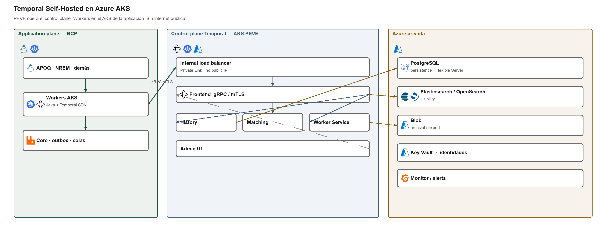

# Retiro de Temporal Cloud ante insolvencia. Resumen para aprobación

**BCP / PEVE / Versión 1.4 / Uso interno**  
El detalle consta en el plan de retiro preventivo. La primera versión del destino es Self-Hosted. La sección 04.6 agrega tres opciones adicionales.

El destino vigente es Temporal Self-Hosted en Azure AKS. PEVE opera el control plane (Frontend, History, Matching y Worker Service). Persistence y visibility quedan en Azure privada. Los workers de APOQ y NREM permanecen en el AKS del Banco. El Frontend no se publica en internet.

Self-Hosted (primera versión) conserva el motor Temporal y no incluye soporte de Temporal Technologies Inc. A esa versión se agregan tres opciones adicionales, todas de ejecución durable en código: Azure Durable Functions (Microsoft opera el control plane), Dapr Workflows en AKS (mismo Durable Task, cómputo en AKS, soporte Azure) y Restate (Enterprise o Self-Managed en AKS; residual: proveedor más joven que Temporal). Un cambio de destino exige reescritura y aprobación formal antes del paso 0.2.

---

## Decisión que se pide

Aprobar el plan de retiro preventivo de Temporal Cloud y autorizar la fase 0 como control del riesgo de pérdida de continuidad de Temporal Technologies Inc. El destino de la primera versión es Self-Hosted. El paso 0.0 confirma ese destino o una de las tres opciones adicionales (Durable Functions, Dapr Workflows, Restate).

Esta aprobación no incluye la migración productiva de APOQ ni de NREM.

---

## Fundamento

Temporal Cloud orquesta y persiste el estado de workflows del Banco. Es un servicio significativo: si Temporal Technologies Inc. no puede seguir operándolo, el control plane deja de estar disponible. El resultado financiero negativo del proveedor es un elemento de vigilancia, no una prueba de quiebra. El riesgo que se trata es el cese de capacidad para operar Temporal Cloud.

Los workers ya se ejecutan en AKS del Banco. El componente que no controla el Banco es el servicio gestionado. La primera versión sustituye ese control plane por el mismo motor Temporal, de código abierto, hospedado por el Banco. Las opciones de la sección 04.6 cambian de motor y exigen reescritura.

---

## Alcance

| Incluido | Excluido |
|---|---|
| Insolvencia, liquidación, cese o pérdida material de Temporal Cloud | Incidente de corta duración (planes de continuidad y recuperación) |
| APOQ y NREM en producción | Aplicaciones de otras empresas del grupo |
| Aplicaciones en desarrollo o certificación: CPCA, CPCC, APTI/TUPI, CDPT, SRCR, LBCL y CPCR | Cambios funcionales ajenos al retiro |
| Destino de la primera versión: Temporal Self-Hosted en Azure AKS | Adopción de Durable Functions, Dapr Workflows o Restate sin acta de la sección 04.6 |

---

## Tres desenlaces y dos modos de actuación

| Situación del proveedor | Temporal Cloud | Actuación del Banco |
|---|---|---|
| Se reorganiza | Suele continuar durante semanas | Migración por ambientes. Conclusión de workflows cortos en Cloud |
| Se vende | Continúa; cambia el dueño | La misma ruta técnica |
| Se liquida o se interrumpe | Puede dejar de estar disponible | Conmutación. Se reconstruye desde el core, no desde el historial vivo |

En liquidación el contrato puede no ofrecer asistencia, exportación ni reversa. Por ello el control es la fase 0.

---

## Restricción operativa

APOQ ejecuta débito, crédito y compensación. NREM emite y recibe remesas. Un workflow o un schedule no puede estar activo en Cloud y en Self-Hosted al mismo tiempo. Si existe duda sobre un lado ya ejecutado, el caso pasa a cola de excepción.

Temporal no es el registro de negocio. Si Cloud deja de estar disponible, la pérdida de información se mide contra el core, el outbox y el seguimiento de remesas.

---

## Gobierno

PEVE gobierna y entrega la receta. Los equipos de aplicación ejecutan. El PO concilia y acepta. Arquitectura, Seguridad, Continuidad, RNF, Legal y Compras emiten sus conformidades. La instancia aprobadora declara la vigilancia, la activación, las excepciones, la producción y el cierre.

La vigilancia consiste en congelar usos nuevos en Cloud y terminar la fase 0.  
La activación inicia el retiro. La disparan un aviso formal, una situación acreditada de pérdida de continuidad del proveedor o la indisponibilidad de Cloud. No la dispara, por sí solo, el resultado financiero del proveedor.

---

## Secuencia

Confirmar el destino (0.0), preparar la plataforma, activar cuando corresponda, validar desarrollo y certificación, migrar producción (APOQ y NREM en paralelo, cada una con sus evidencias), retirar Cloud y cerrar el expediente.

Ninguna aplicación del inventario pasará a producción sobre Temporal Cloud.

---

## Condición para declarar el plan operativo

Fase 0 completa (Anexo F): destino confirmado primero (F14 / D13); plataforma destino con restauración ensayada; segregación por ambiente de APOQ y NREM; indicador contra ejecución simultánea (conexión dual solo si Self-Hosted); historiales de Cloud copiados a almacenamiento del Banco; matriz de workflows firmada por los PO; tiempos de recuperación vigentes; ejercicio técnico y ejercicio de mesa “Cloud no responde”. Si el paso 0.0 elige Durable Functions, Dapr Workflows o Restate, rige el Anexo B.4 y no hay conexión dual.

Hasta entonces, el riesgo residual es la dependencia operativa de Temporal Cloud.

---

## Pedidos de aprobación

| Pedido | Efecto |
|---|---|
| Aprobar este plan como versión vigente | PEVE lo mantiene. RNF o Auditoría lo revisa anualmente |
| Autorizar la fase 0 | PEVE, Arquitectura, Seguridad, APOQ y NREM ejecutan el Anexo F |
| Confirmar el destino (paso 0.0) | Sin acta en contrario, rige Self-Hosted. Durable Functions, Dapr Workflows o Restate solo con aprobación de Arquitectura y Compras |
| Congelar namespaces productivos nuevos en Temporal Cloud | Las aplicaciones en certificación solo producen sobre el destino aprobado |
| Reservar la activación a la instancia | Nadie retira Cloud ni ejecuta la conmutación productiva sin acta |

La arquitectura (sección 04), la hoja de ruta de la fase 0 (sección 14), la actuación en el día de activación (Anexo E) y la información a completar (Anexo G) constan en el plan.
