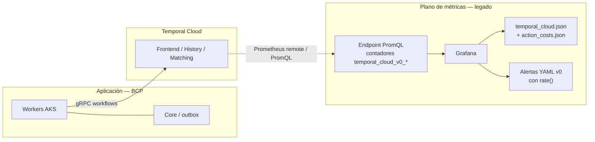
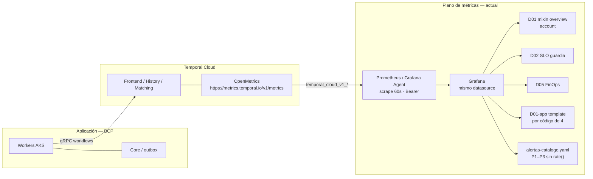

# Arquitectura de métricas Temporal Cloud — antes vs ahora

Diagrama Draw.io: [arquitectura-metricas.drawio](./arquitectura-metricas.drawio) (abrir en diagrams.net o la extensión Draw.io).  
Libreto para presentarlo: [arquitectura-metricas-libreto.md](./arquitectura-metricas-libreto.md).

Solo el **plano de métricas**. Los workers siguen en AKS; el runtime de Temporal Cloud no cambia. Lo que se retira es el endpoint PromQL v0 (`temporal_cloud_v0_*`), apagado el **5 oct 2026**.

**Autenticación:** antes hacía falta un **certificado de cliente (mTLS)** contra el PromQL. Ahora el scrape OpenMetrics va con **API key Bearer** (rol Metrics Read-Only). El certificado de v0 se retira con ese endpoint.

## Antes — PromQL v0 (legado)

Grafana consultaba un endpoint PromQL de Temporal. Las series eran **contadores acumulados**. Había que envolverlas en `rate()` / `increase()`. FinOps iba en otro JSON (`temporal_cloud_action_costs.json`).

Problemas: queries no portables a v1, un dashboard de costs aparte, deprecado 2 abr 2026, **corte 5 oct 2026**.

## Ahora — OpenMetrics v1

Un scrape HTTPS a `metrics.temporal.io/v1/metrics` (API key, rol Metrics Read-Only). Las series `temporal_cloud_v1_*` ya son **rate/s o gauge** en ventana de 1 minuto. **No** usar `rate()`. Un overview (mixin = D01). Encima: D02, D05, template por app.

Fuera de este corte (igual que antes): métricas SDK `temporal_*`, slots de worker, Private Link, AKS.

## Qué cambió

| | Antes (v0) | Ahora (OpenMetrics v1) |
|---|---|---|
| Endpoint | PromQL Temporal Cloud | `GET /v1/metrics` OpenMetrics |
| Prefijo | `temporal_cloud_v0_*` | `temporal_cloud_v1_*` |
| Tipo | Contador acumulado | Rate/s o gauge (1 min) |
| Queries | `rate()` / `increase()` | `sum`, `avg`, `sum_over_time` |
| Autenticación | **Certificado cliente (mTLS)** | **API key Bearer** (Metrics Read-Only) |
| Scrape | Consulta remota PromQL | Pull 60 s + API key |
| Overview | `temporal_cloud.json` | Mixin Grafana = D01 |
| FinOps | `action_costs.json` v0 | D05 sobre `billable_action_count` |
| Guardia / app | No había pack BCP | D02, D01-app |
| Estado | No usar. Apagado 5 oct 2026 | Canónico |

Si en Explore aparece `v0_*`, el datasource sigue en el camino viejo. D02, D05 y D01-app no funcionan contra v0.
